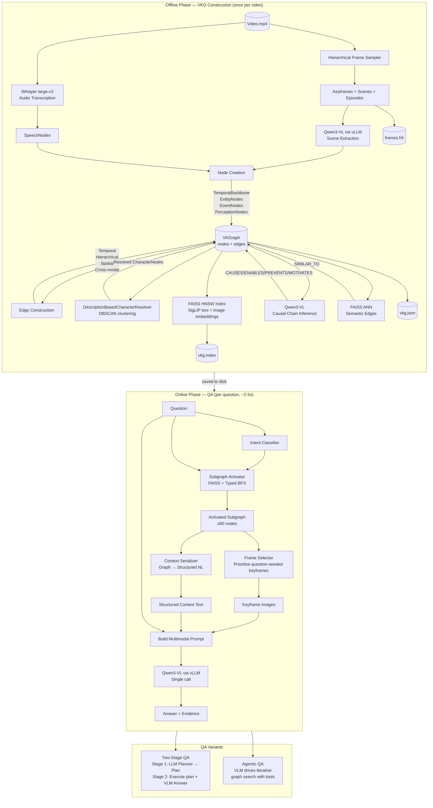
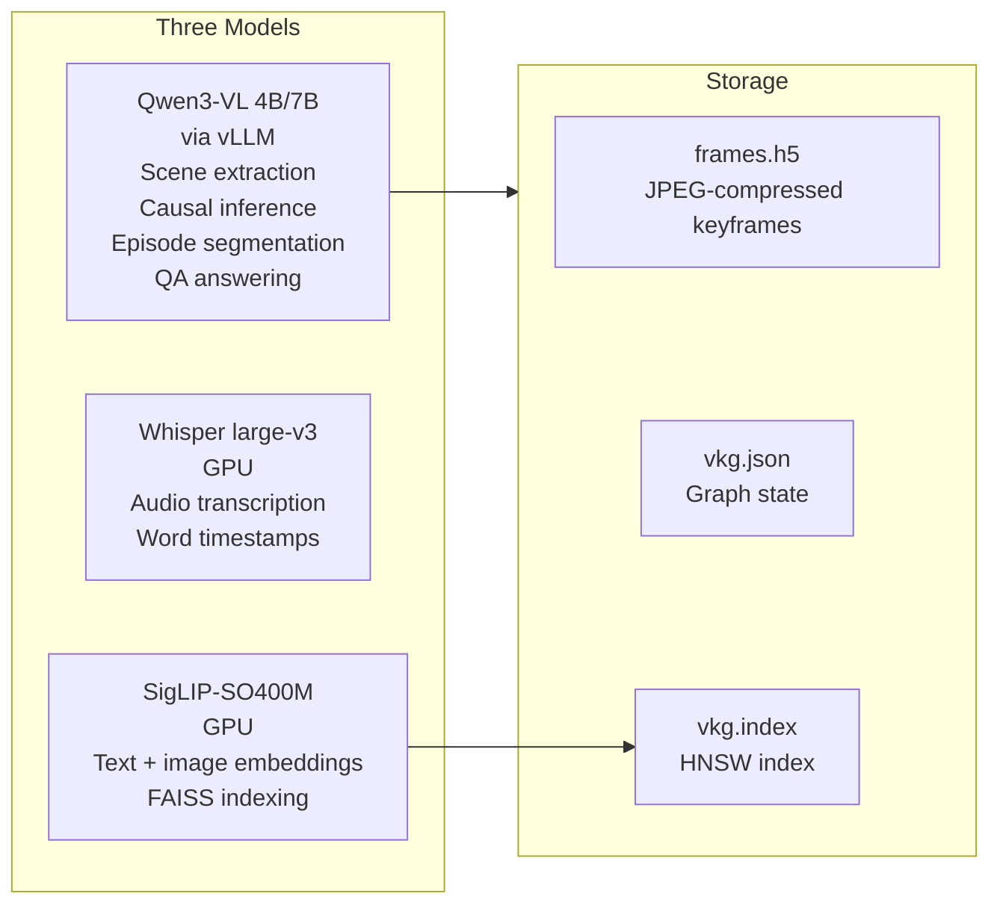
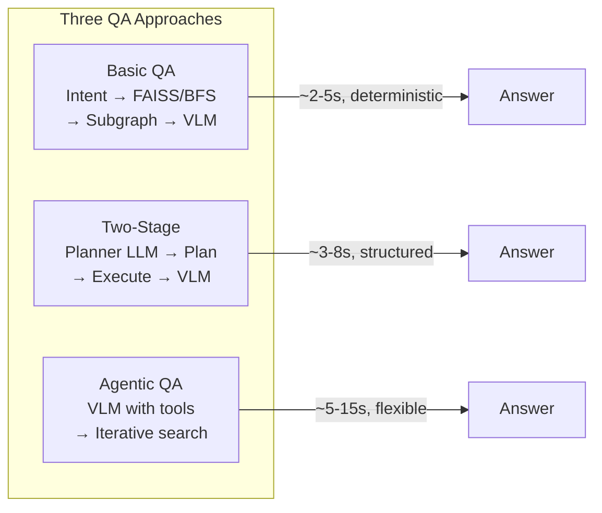

# Q-VKG Architecture

## System Overview



## Model Stack



## Data Flow — Step by Step

| Step | Component | Input | Output | Time (100 min video) |
|------|-----------|-------|--------|---------------------|
| 1 | HierarchicalSampler | Video | ~500 keyframes, ~206 scenes | ~8-15 min |
| 2 | Whisper | Video | SpeechNodes (timestamped transcript) | ~2-5 min (overlaps with Step 1) |
| 3 | Scene Extraction (Qwen) | Keyframes + scenes | SceneData (labels, objects, actions, OCR, spatial) | ~2-3 min |
| 3b | Episode Segmentation (Qwen) | Scene labels | EpisodeNodes (10-30 episodes) | ~10 sec |
| 4-8 | Node/Edge builder | SceneData | Fully connected VKGraph | ~30 sec |
| 9 | FAISS builder | Graph nodes | vkg.index (HNSW) | ~10 sec |
| 10 | Causal inference (Qwen) | Episodes + keyframes | CausalEdges | ~1-2 min |
| 11 | Semantic edges (FAISS) | FAISS index | SIMILAR_TO edges | ~5 sec |

## Edge Taxonomy

```
Temporal:    PRECEDES, OVERLAPS, DURING
Hierarchy:   CONTAINS, INSTANCE_OF
Entity:      SAME_ENTITY, PERFORMS, INTERACTS_WITH, LOCATED_IN
Spatial:     LEFT_OF, RIGHT_OF, ABOVE, BELOW, IN_FRONT_OF, BEHIND, NEAR
Causal:      CAUSES, ENABLES, PREVENTS, MOTIVATES
Semantic:    SIMILAR_TO, CONTRADICTS
Cross-modal: DESCRIBES, MENTIONS, LABELS, ACCOMPANIES
```

## Query Paths



## Project Layout

```
qvkg/
├── qvkg/                     ← library code
│   ├── builder.py            ← 11-step VKG construction orchestrator
│   ├── sampler.py            ← hierarchical frame sampling (CPU + SigLIP)
│   ├── extraction.py         ← VLM scene extraction (Qwen via vLLM)
│   ├── causal.py             ← LLM causal chain inference
│   ├── character.py          ← DBSCAN description-based character resolution
│   ├── episode.py            ← LLM episode segmentation
│   ├── schema.py             ← VKGNode, VKGEdge, VKGraph, SubGraph
│   ├── vllm_client.py        ← LLM/SigLIP factory, sampling params, JSON schemas
│   ├── faiss_index.py        ← FAISS HNSW index + semantic edges
│   ├── frame_store.py        ← HDF5 keyframe storage (JPEG-compressed)
│   └── query/                ← online QA pipeline
│       ├── qa.py             ← single-call answer_question()
│       ├── intent.py         ← question intent classification
│       ├── activator.py      ← subgraph activation (FAISS + typed BFS)
│       ├── serializer.py     ← graph → structured NL context
│       ├── frame_extractor.py← on-demand frame extraction from raw video
│       ├── two_stage.py      ← planner → execute → answer
│       ├── agent.py          ← VLM-driven iterative graph search
│       └── react_agent.py    ← ReAct-style agent for complex queries
├── scripts/
│   ├── build_vkg.py          ← offline VKG construction CLI
│   ├── query_vkg.py          ← online QA CLI
│   ├── eval_lvbench.py       ← LVBench evaluation runner (resume-safe)
│   └── verify_flash_attn.py  ← flash-attn smoke test
├── configs/default.yaml      ← default configuration
├── setup.py                  ← Python package install
├── requirements.txt          ← pip dependencies
├── SETUP.md                  ← setup guide
├── ARCHITECTURE.md           ← this file
├── perf_optimizations.md     ← performance plan
└── tests/                    ← pytest unit tests
    ├── test_sampler.py
    ├── test_schema.py
    ├── test_intent.py
    └── test_frame_extractor.py
```
